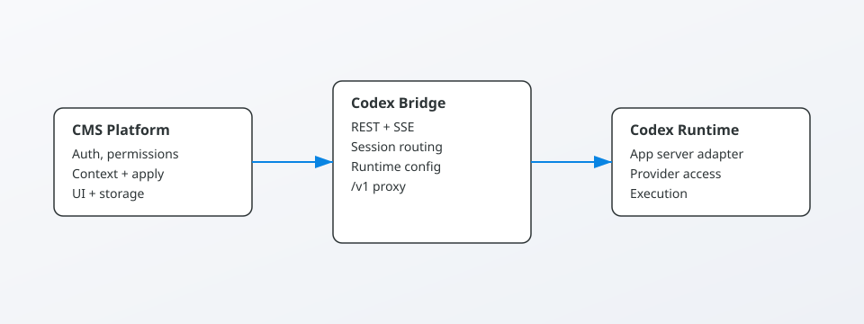
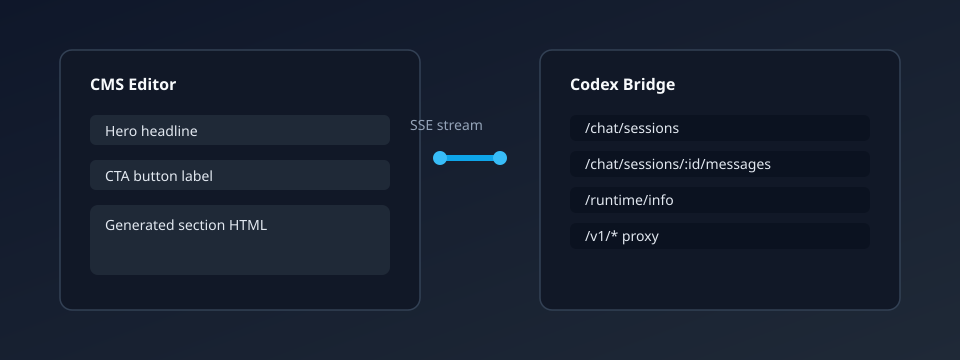

# Codex Bridge

[](LICENSE)
[](docker-compose.yml)
[](#environment)

This repo provides a CMS-friendly Codex runtime bridge. It exposes a small REST + SSE surface that content platforms can call for chat sessions, auth, runtime info, and streaming events.

## Why This Exists

Most CMS platforms need Codex to fit into their own auth, UI, and content workflows. This bridge keeps the integration light: the CMS owns permissions and content actions, while the runtime focuses on execution and streaming.

## Grant Pitch

The Codex Bridge enables open, interoperable AI editing for CMS platforms without vendor lock-in. It reduces integration time from weeks to hours, supports local or cloud models via OpenAI-compatible routes, and keeps platform-specific permissions and content workflows in the CMS where they belong. Funding will help us harden the runtime, improve performance, and deliver plug-and-play adapters for popular CMS stacks.

## What’s Inside

- `server.mjs`: main bridge service (Node.js)
- `app-server-client.mjs`: client utilities for the app-server adapter runtime

## Running Locally

```bash
npm install -g @openai/codex
node server.mjs
```

The bridge listens on port `4318` by default. You can override via `CODEX_BRIDGE_PORT`.

## CMS Integration

A CMS image or VM can copy this repository into `/opt/codex-bridge` and run:

```bash
node /opt/codex-bridge/server.mjs
```

The CMS talks to the bridge through the Codex service URL (see provider settings in your platform).

## Environment

Common variables:

- `CODEX_BRIDGE_PORT` (default `4318`)
- `CODEX_RUNTIME_KIND` (default `app_server_adapter`)
- `CODEX_WORKSPACE_ROOT` (CMS workspace root)

## Docker Compose (Local Testing)

Run the bridge locally with Docker Compose:

```bash
docker compose up --build
```

This starts the bridge on port `4318` and mounts the current repo into the container. You can override environment variables in `docker-compose.yml`.

## API Surface (Core)

| Method | Path | Purpose |
| --- | --- | --- |
| `GET` | `/health` | Health + auth state |
| `GET` | `/runtime/info` | Runtime metadata |
| `GET` | `/runtime/config` | Current runtime config |
| `POST` | `/runtime/config` | Update runtime config |
| `POST` | `/chat/sessions` | Create a session |
| `GET` | `/chat/sessions/:id` | Read a session |
| `GET` | `/chat/sessions/:id/stream` | SSE stream |
| `POST` | `/chat/sessions/:id/messages` | Send a message |
| `DELETE` | `/chat/sessions` | Clear sessions |
| `GET` | `/auth/device` | Device auth start |
| `GET` | `/auth/status` | Auth status |

## Architecture



## Demo



## Quick Demo

```bash
curl -s http://localhost:4318/runtime/info | jq .
```

Create a session and send a message:

```bash
curl -s -X POST http://localhost:4318/chat/sessions \
  -H "Content-Type: application/json" \
  -d '{"context":{"context_name":"Homepage","context_type":"page","context_id":"123"}}' | jq .

curl -s -X POST http://localhost:4318/chat/sessions/SESSION_ID/messages \
  -H "Content-Type: application/json" \
  -d '{"message":"Create a hero section with a call-to-action."}' | jq .
```

## Project Docs

- License: `LICENSE` (Apache 2.0)
- Security policy: `SECURITY.md`
- Changelog: `CHANGELOG.md`
- Notices: `NOTICE`
- Roadmap: `docs/roadmap.md`
